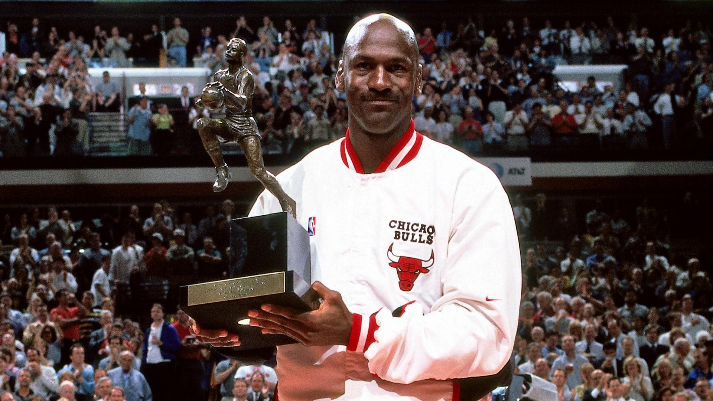

```{r libraries}
#| echo: false

library(tidyverse)
library(janitor)
library(stringi)
library(tinytex)
```

```{r data-combine}
#| echo: false

# Read in player props dataset and clean column names
# Create a cleaned player name column so names match across datasets
props <- read_csv("nba_player_props.csv") |>
  clean_names() |>
  mutate(player_clean = stri_trans_general(name, "Latin-ASCII"))

# Read in advanced stats datset and clean column names
# Create same cleaned player name column for merging
advanced <- read_csv("nba_2022-23_all_stats.csv") %>%
  clean_names() %>%
  mutate(player_clean = stri_trans_general(player_name, "Latin-ASCII")) %>%
  mutate(
    player_clean = str_trim(player_clean),
    player_clean = case_when(
      str_detect(player_clean, "Jokic") ~ "Nikola Jokic", 
      str_detect(player_clean, "Doncic") ~ "Luka Doncic",
      TRUE ~ player_clean
    )
  )

# Keep only advanced variables needed for MVP model
advanced_small <- advanced %>%
  select(player_clean, per, ws, bpm)

# Merge two datasets together using cleaned player name
# Still want to add TEAM WIN PERCENTAGE variable into dataset
nba_combined <- props %>%
  left_join(advanced_small, by = "player_clean")
```

```{r add-win-percentage}
#| echo: false

# Add team win percentage
team_wins <- tibble(
  team = c("Den", "Phi", "Mil", "Bos", "Okc", "Cle", "Sac",
           "Dal", "Gol", "Mia", "Nyk", "Mem"),
  wins = c(53, 54, 58, 57, 40, 51, 48, 38, 44, 44, 47, 51),
  losses = c(29, 28, 24, 25, 42, 31, 34, 44, 38, 38, 35, 31)
) %>%
  mutate(team_win_pct = wins / (wins + losses))
```

```{r mvp-votes}
#| echo: false

library(dplyr)
#Add row of MVP points, only the 12 players seen below received votes. Data is from Basketball Reference
nba_combine <- nba_combined %>%
  mutate(mvp_points = case_when(
    name == "Joel Embiid"             ~ 915,
    name == "Nikola Jokic"            ~ 674,
    name == "Giannis Antetokounmpo"   ~ 606,
    name == "Jayson Tatum"            ~ 280,
    name == "Shai Gilgeous-Alexander" ~ 46,
    name == "Donovan Mitchell"        ~ 30,
    name == "Domantas Sabonis"        ~ 27,
    name == "Luka Doncic"             ~ 10,
    name == "Stephen Curry"           ~ 5,
    name == "Jimmy Butler"            ~ 3,
    name == "De'Aaron Fox"            ~ 2,
    name == "Jalen Brunson"           ~ 1,
    TRUE ~ 0  # Assigns 0 to everyone else
  ))

```

```{r data-clean}
#| echo: false

# Remove rows with missing values (ensure accurate standardization and model construction)
nba_model_clean <- nba_combined %>%
  left_join(team_wins, by = "team") %>%
  drop_na(ppg, apg, rpg, bpg, spg, tpg, ts_percent, per, bpm, ws, team_win_pct)

# Confirm no missing values left in cleaned dataset for variables in use for MVP model
#colSums(is.na(nba_model_clean))
```

```{r z-model}
#| echo: false

# Standardize each variable using z-scores so all stats are on same scale 
nba_z <- nba_model_clean %>%
  mutate(
    PPG_z = as.numeric(scale(ppg)),
    APG_z = as.numeric(scale(apg)),
    RPG_z = as.numeric(scale(rpg)),
    BLK_z = as.numeric(scale(bpg)),
    STL_z = as.numeric(scale(spg)),
    TO_z = as.numeric(scale(tpg)) * (-1), # multiplied by -1 because having more turnovers are worse
    TS_z = as.numeric(scale(ts_percent)),
    PER_z = as.numeric(scale(per)),
    BPM_z = as.numeric(scale(bpm)),
    WS_z = as.numeric(scale(ws)),
    TEAM_WIN_z = as.numeric(scale(team_win_pct))
  )
```

```{r production-score}
#| echo: false

# Create Production Score (Box Score Stats)
nba_z <- nba_z %>%
  mutate(
    production_score = (PPG_z + APG_z + RPG_z + STL_z + BLK_z + TO_z) / 6
  )

# Create Efficiency/Advanced Score
nba_z <- nba_z %>%
  mutate(
    advanced_score = (TS_z + PER_z + BPM_z + WS_z) / 4
  )

nba_z <- nba_z %>%
  mutate(
    team_success_score = (TEAM_WIN_z)
  )
```

```{r mvp-score}
#| echo: false

# MVP Score (Temporary - no team success yet)
nba_z <- nba_z %>%
  mutate(
    mvp_score = 0.4 * production_score + 0.4 * advanced_score + 0.2 * team_success_score
  )


```

```{r mvp-candidates}
#| echo: false

# Filter MVP Candidates
mvp_players <- c(
  "Joel Embiid",
  "Nikola Jokic",
  "Giannis Antetokounmpo",
  "Jayson Tatum",
  "Shai Gilgeous-Alexander",
  "Donovan Mitchell",
  "Domantas Sabonis",
  "Luka Doncic",
  "Stephen Curry",
  "Jimmy Butler",
  "De'Aaron Fox",
  "Jalen Brunson",
  "Ja Morant"
)

mvp_results <- nba_z %>%
  filter(name %in% mvp_players)
```

```{r mvp-points}
#| echo: false

# Create a table of real MVP voting results for players who received votes
mvp_votes <- tibble(
  name = c(
    "Joel Embiid",
    "Nikola Jokic",
    "Giannis Antetokounmpo",
    "Jayson Tatum",
    "Shai Gilgeous-Alexander",
    "Donovan Mitchell",
    "Domantas Sabonis",
    "Luka Doncic",
    "Stephen Curry",
    "Jimmy Butler",
    "De'Aaron Fox",
    "Jalen Brunson",
    "Ja Morant"
  ),
  mvp_points = c(915, 674, 606, 280, 46, 30, 27, 10, 5, 3, 2, 1, 0)
)

# Join real MVP voting points to the custom MVP model results
mvp_compare <- mvp_results %>%
  left_join(mvp_votes, by = "name")

```


```{r mvp-players}
#| echo: false

# Filter out to NBA players who received MVP Votes
mvp_players <- c(
  "Joel Embiid",
  "Nikola Jokic",
  "Giannis Antetokounmpo",
  "Jayson Tatum",
  "Shai Gilgeous-Alexander",
  "Donovan Mitchell",
  "Domantas Sabonis",
  "Luka Doncic",
  "Stephen Curry",
  "Jimmy Butler",
  "De'Aaron Fox",
  "Jalen Brunson",
  "Ja Morant"
)

```

```{r rank-players}
#| echo: false

# Rank Players
mvp_rankings <- mvp_results %>%
  select(name, team, production_score, advanced_score, mvp_score) %>%
  arrange(desc(mvp_score))

```

```{r mvp-compare-table}
#| echo: false

# Comparison Table for Custom Score vs Real Voting Results (without team success)
mvp_compare_table <- mvp_compare %>%
  select(name, team, mvp_score, mvp_points) %>%
  arrange(desc(mvp_score))
```


## Introduction

The NBA Most Valuable Player (MVP) Award is considered the league's most prestigious individual honor. Winning the MVP award can change a player's legacy, influence boosted contracts and endorsement deals, and generate meaningful fan discussions. Some notable MVP's include LeBron James, Michael Jordan, and Steph Curry. Because the award represents both individual and team success, MVP debates have become one of the most discussed topics in all of professional sports. 

{fig-align="center" width="603"}

[Image from\ The Sporting News](https://www.sportingnews.com/in/chicago-bulls/news/this-date-in-nba-history-may-18-michael-jordan-is-named-nba-mvp-in-1998-and-more/1rdjlayfa1mvs13q04ij8dt2ta)

There is no strict formula for determining the NBA MVP Award, as it is voted on by media members which makes the process very subjective. Different voters may prioritize different aspects of performance like scoring, efficiency, team success, or other narrative factors. During the 2022-2023 season, debates surrounding Nikola Jokic, Joel Embiid, and Giannis Antetokounmpo highlighted disagreements regarding which statistics and achievements should matter most in determining the MVP. Jokic domintated advanced statistics, so he had a strong analytical case. Embiid led the league in scoring so he was backed up by the traditional scoring argument. Lastly, Giannis led his team to the best record in the league. 

The goal of our project is to develop a custom statistical MVP model and evaluate how well it explains the actual MVP voting outcomes during the 2022-2023 NBA season. By combining traditional box score statistics, advanced efficiency statistics, and team success metrics into a single MVP score, we try to investigate whether player performance alone can explain MVP voting patterns. More specifically, our analysis explores which players rank highest in the model, whether MVP score predicts MVP candidacy, and how closely our model aligns with the real voting results. 

## Methodology

The data for this project came from two separate datasets that included statistics from NBA players in the 2022-2023 NBA season. One of the datasets was from NBA Stuffer, which included per-game player statistics. Our other dataset was from Kaggle, which included advanced efficiency statistics for each player. We combined the datasets by using cleaned player names after standardizing formatting inconsistencies. A few missing values for key variables were removed so that we could ensure our models and results were accurate. 

We also filtered the dataset to only include player who received MVP votes, to reduce noise and so that our results were focused on the relevant candidates for analysis. We created a new variable to import MVP votes per player to compare to our custom MVP model.

We chose a select amount of variables to capture multiple dimensions of player performance for our custom MVP model. Regular box score statistics/traditional production statistics like points, rebounds, assists, steals, block, turnovers, and advanced metrics like True Shooting Percentage (TS %), Player Efficiency Rating (PER), Box Plus Minus (BPM). and Win Shares (WS) were included in to evaluate efficiency and overall impact. We also added team win percentage to take team success into account because winning is usually considered important in MVP voting. 

Some of the new variables we created included were:
- Production score: average of standardized box score stats
- Advanced score: average of standardized efficiency and advanced metrics
- Custom MVP score: weight combination of production, advanced, and team success scores

Because some variables like points per game and win shares are measured on different scales, we decided to standardize our variables using z-scores before constructing our MVP model. Standardizing our chosen variables made sure that no single variable would dominate our custom model because of its scale and allows us to combine multiple stats into one MVP score. The final MVP score was constructed as a weighted combination of the three categories, with production and advanced statistics each taking up 40% of the score and team success taking contributing to the last 20%. We chose these weights to balance statistical production with efficiency based metrics while also taking into account team performance. We also changed the weights between the 3 pillars of our equation to see if results would change drastically or not but saw that the strongest MVP candidate orders remained generally the same. 

MVP Score: 0.4 (Production Score) + 0.4 (Advanced Score) + 0.2 (Team Success)

To see if our custom MVP model could statistically predict MVP caliber players, we decided to fit a logistic regression model using MVP candidacy as the response variable. We grouped player by classifying players who received MVP votes as MVP candidates, while the rest of the players were classified as non-candidates. Using a logistic regression was an appropriate as the response variables was binary. 

The custom MVP score was used as the predictor variable in the model as our equation is:
log (p / 1 - p) = -6.782 + 6.477(mvp_score)

In our equation, (p) represents the probability that a player is classified as an MVP candidate. This model was used to examine whether higher MVP scores were associated with an increased probability of receiving MVP votes.

On top of the MVP Model and logistic regression model, we also used clustering as an exploratory method to group player based on the statistical profiles. Players were clustered based on their production and advanced scores in order to see if MVP candidates naturally formed their own performance group compared to the rest of the players in the league. 

Two clusters were created which represented the higher and lower performing statistically profiled players. The players in the red cluster points were those who had both lower production and advanced scores which represented average/below average players. The players in the teal clustered points were those who had both higher production and advanced score which represented the top-performing/elite level players. Visualizing these clusters allowed us to compare MVP candidates from the rest of the NBA, helping us see if those elite players were separated clearly from other players based on the variables we used in our custom MVP model.

## Results


```{r mvp-scores-graph}
#| echo: false

# Visualizing Scores
ggplot(mvp_rankings, aes(x = reorder(name, mvp_score), y = mvp_score)) +
  geom_col(fill = "steelblue") +
  coord_flip() +
  labs(
    title = "Custom MVP Rankings",
    x = "Player",
    y = "MVP Score"
  ) + 
  theme_minimal()

# This plot ranks players based on our custom MVP score, which combines both production and advanced metrics (no team success pillar added yet). It shows that players like Jokic and Embiid stand out as top candidates due to strong overall performance.
```

The custom MVP model ranked Nikola Jokic as the top performer during the 2022-2023 NBA season, and the following candidates were Joel Embiid and Giannis Antetokonmpo. Players like Jokic and Embiid consistently scored highly across all the pillars of performance in our custom model, especially in the advanced efficiency metrics. 

```{r mvp-points-vs-score}
#| echo: false
ggplot(mvp_compare_table, aes(x = mvp_score, y = mvp_points, label = name)) +
  geom_point(size = 3) +
  geom_text(nudge_y = 50, size = 3) +
  scale_x_continuous(expand = expansion(mult = 0.15)) +
  labs(
    title = "MVP Score vs MVP Voting Points",
    x = "MVP Score",
    y = "MVP Points"
  ) +
  theme_minimal()
```

The MVP score showed a positive relationship with the actual MVP voting results. Players with higher MVP scores generally received more MVP voting points, which means that our custom model lined up pretty well with the real voting outcomes. There were some differences in the model rankings and the actual voting results though. For example, the model ranked Jokic above Embiid, but Embiid was the actual player who won the MVP award for that season. This means that there are other factors beyond statistics that influence the final voting outcomes for MVP.

### Logistic Regression:
```{r mvp-Z}
#| echo: false

# Add row indicating mvp candidate

library(dplyr)
#Add row of MVP points, only the 12 players seen below received votes. Data is from Basketball Reference
nba_z <- nba_z %>%
  mutate(mvp_points = case_when(
    name == "Joel Embiid"             ~ 915,
    name == "Nikola Jokic"            ~ 674,
    name == "Giannis Antetokounmpo"   ~ 606,
    name == "Jayson Tatum"            ~ 280,
    name == "Shai Gilgeous-Alexander" ~ 46,
    name == "Donovan Mitchell"        ~ 30,
    name == "Domantas Sabonis"        ~ 27,
    name == "Luka Doncic"             ~ 10,
    name == "Stephen Curry"           ~ 5,
    name == "Jimmy Butler"            ~ 3,
    name == "De'Aaron Fox"            ~ 2,
    name == "Jalen Brunson"           ~ 1,
    TRUE ~ 0  # Assigns 0 to everyone else
  ))

```

```{r logit-Z}
#| echo: false

nba_z <- nba_z |> 
  mutate(mvp_candidate = case_when(
    mvp_points > 0 ~ "Y",
    TRUE ~ "N"
  ))

nba_logit <- nba_z |>
  mutate(mvp_score = 0.4 * production_score + 0.4 * advanced_score + 0.2 * team_success_score)

```


```{r}
#| echo: false
# Logistic regression model for mvp score
nba_logit <- nba_logit |>
  mutate(candidate_binary = ifelse(mvp_candidate == "Y", 1, 0))

logit <- glm(candidate_binary ~ mvp_score, 
                data = nba_logit,
                family = "binomial")

summary(logit)
```

Our logistic regression model showed that our custom MVP score was a statistically significant predictor of MVP candidacy. The coefficient for our MVP score was positive (6.447) and highly significant (p-value = 5.34e-05). Our logistic regression model results mean that a 1-unit increase in MVP score multiplies the odds of a player being an MVP candidate by about e^647.

```{r confusion-matrix}
#| echo: false

library(broom)
library(yardstick)

# 1. Get predictions (probabilities)
nba_results <- logit %>%
  augment(type.predict = "response") %>%
  mutate(pred_binary = factor(ifelse(.fitted > 0.4, 1, 0)),
         candidate_binary = factor(candidate_binary))

# 2. Generate the Confusion Matrix
nba_results %>%
  conf_mat(truth = candidate_binary, estimate = pred_binary)

# 3. Calculate Accuracy
nba_results %>%
  accuracy(truth = candidate_binary, estimate = pred_binary)
```

### Clustering:

To evaluate predictive performance, we created a confusion matrix to compare the predicted MVP candidates with the actual MVP candidates. Our model was able to classify 214 non-candidates and 8 MVP candidates correctly. Overall, our logistic regression model was able to accurately identify about 96.9% of NBA players, which suggests strong classification performance. 

```{r set-up-cluster}
#| echo: false

set.seed(123)

# K-means clustering with 2 clusters (high vs low performers)
kmeans_result <- kmeans(nba_z$mvp_score, centers = 2)

# Add cluster labels
nba_z$cluster <- as.factor(kmeans_result$cluster)
```

```{r cluster}
#| echo: false

# Plot clusters to visualize how players group based on performance (each point represents a player)
# Helps identify whether MVP-level player form a distinct group
ggplot(nba_z, aes(x = production_score, y = advanced_score, color = cluster)) +
  geom_point(size = 3) +
  geom_text(aes(label = ifelse(name %in% mvp_players, name, "")),
            size = 3, vjust = -1) +
  labs(
    title = "Clusters of Players (Production vs Advanced Score)",
    x = "Production Score",
    y = "Advanced Score"
  ) +
  theme_minimal()
```

Lastly, our clustering model supported the effectiveness of our custom MVP model further as our MVP caliber players were located in the higher performing cluster. Our top performing players, Joel Embiid and Nikola Jokic, appeared in the top right region of the production score vs advanced score visualization, which shows all around statistical impact across multiple categories. 

## Discussion

The results of our project suggests that our custom MVP model was successful for the most part in identifying MVP caliber players and explaining many different aspects of the voting. The MVP score showed a strong positive relationship with actual MVP voting points. Our logistic regression model also showed that higher MVP scores increased the probability of being classified as an MVP candidate. On top of this, our clustering model showed that many of the MVP candidates were naturally grouped together based on their production and efficiency metrics/scores. 

One of the most important findings in our analysis was the difference in our model rankings versus the actual MVP results. Joel Embiid won the 2022-2023 NBA MVP award, but our custom MVP model showed that Nikola Jokic was our top performer. The difference between these two results highlights the subjectivity and complexity of MVP voting. Jokic excelled in his performance across the advanced metrics such as PER, BPM, and WS which strongly influenced our model. On the other hand, MVP voting likely takes into account additional factors beyond just statistics, like narrative, voter fatigue, media perception, and team story lines.

Our model was also able to show us how different definitions of "value" can influence MVP evaluations. For example, traditional box score production favors players with high scoring. On the other hand, advanced metrics rewards players who are more efficient and provide more of an overall impact to their team. We attempted to combine these categories into a single MVP score in hopes of balancing these competing perspectives. 

There are several limitations we wanted to make sure were known. First, the model weights we chose were subjective rather than optimized in a statistical manner. Second, we only covered defensive impact partially through basic metrics and BPM. Third, our team success variable was very simplified as we only used the team's win percentages throughout the regular season and didn't take into account strength of schedule or playoff expectations. Lastly, our analysis only examined a single NBA season, which limited our ability to generalize results across different eras and seasons. 

Some future improvements we could include are including more advanced defensive metrics, analyzing multiple NBA seasons, or applying some machine learning methods to improve prediction accuracy. Other variables like injuries, roster strength, or voter trends could also help explain differences between statistical models and real world MVP voting outcomes. 


